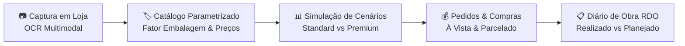

# 🏗️ Sistema de Obras — App de Gestão de Materiais e Controle de Canteiro

Sistema modular para gestão integrada de suprimentos, orçamentos e acompanhamento de obras e reformas.

O produto nasce para resolver a dispersão de dados na construção civil, conectando o momento de **captura de etiquetas de preços em lojas físicas** (via OCR com visão computacional / IA multimodal) até o **controle de compras, desembolso financeiro e avanço físico no canteiro**.

---

## 🎯 Proposta de Valor e Fluxo Contínuo

1. **Captura em Loja Física:** Fotografar etiquetas em gôndolas e caixas de materiais, extraindo marca, SKU, preço à vista/prazo e unidade com auxílio de IA e confirmação humana.
2. **Catalogação Parametrizada:** Histórico de preços por loja e cálculo de fator de embalagem (ex: conversão de m² de projeto para caixas fechadas).
3. **Orçamento e Cenários:** Definição de ambientes com metragens e simulações comparativas para tomada de decisão institucional.
4. **Execução Financeira:** Controle de compras com comprovantes fiscais e gestão de fluxo de caixa (compras à vista vs parceladas no cartão em até 6x).
5. **Acompanhamento Físico (RDO):** Cronograma de execução, checklist de etapas e diário de obra com registro fotográfico.

---

## 🏛️ Projeto Piloto em Produção: Obra ICENV 2026

O desenvolvimento deste software está sendo validado em um ambiente de obra real:
* **Projeto:** Reforma do Banheiro da Casa Pastoral e Bloco Masculino da Igreja (ICENV).
* **Data Oficial de Início:** **13/10/2026** (Duração estimada: 5 semanas).
* **Orçamento Teto Estimado:** **R$ 53.825,00** (Mão de Obra: R$ 32.500,00 | Materiais: R$ 21.325,00).
* **Pasta de Documentos & Dados da Obra Piloto:** `H:\Meu Drive\01. ICENV\Obras_2026`

---

## 🧭 Estrutura do Repositório

| Diretório | Descrição |
| :--- | :--- |
| [`📁 docs/`](./docs/) | Prontuário do produto, especificações funcionais e modelo de dados detalhado. |
| [`📁 vault/`](./vault/) | Base de conhecimento (Vault) com histórico de decisões, benchmarking 2024 e premissas. |
| [`📁 data/`](./data/) | Seeds e esquemas iniciais de dados (lojas homologadas, taxonomia de materiais). |
| [`📁 src/`](./src/) | Código-fonte da aplicação (PWA / Frontend / Backend). |

---

## 🚀 Status de Desenvolvimento

* [x] **v1.0:** Prontuário inicial de produto e requisitos de alto nível.
* [x] **v1.1:** Separação do repositório dedicado, incorporação do benchmarking 2024, criação do Vault e expansão do modelo relacional.
* [x] **v1.2:** Implementação do **Módulo 1 (Captura & Cadastro Inteligente)**:
  - PWA Mobile-First instalável no smartphone para uso no corredor de lojas e depósitos.
  - OCR Multimodal assistido com extração automática de marca, SKU, preço à vista e a prazo.
  - Conversor dinâmico de fator de embalagem (m² para caixas fechadas, kg para sacos, litros para latas).
  - Endpoints REST para catálogo unificado (`/materiais`), análise OCR (`/captura/analisar`) e gravação atômica (`/captura/salvar`).
* [ ] **v2.0:** Módulo de Orçamentos por Ambiente e Cenários (Standard vs Premium) para o início da obra em 13/10/2026.