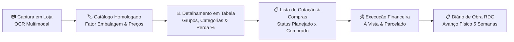

# 🏗️ Sistema de Obras — App de Gestão de Materiais e Controle de Canteiro

Sistema modular para gestão integrada de suprimentos, orçamentos e acompanhamento de obras e reformas.

O produto nasce para resolver a dispersão de dados na construção civil, conectando o momento de **captura de etiquetas de preços em lojas físicas** (via OCR com visão computacional / IA multimodal) até o **controle de compras, desembolso financeiro e avanço físico no canteiro**.

---

## 🎯 Proposta de Valor e Fluxo Contínuo

1. **Captura em Loja Física:** Fotografar etiquetas em gôndolas e caixas de materiais, extraindo marca, SKU, preço à vista/prazo e unidade com auxílio de IA e confirmação humana.
2. **Catalogação Parametrizada:** Histórico de preços por loja e cálculo de fator de embalagem (conversão de m² de projeto para caixas fechadas, kg para sacos, etc.).
3. **Detalhamento do Projeto em Tabela:** Estruturação hierárquica por Grupos (Classes) e Categorias, com visual compacto em tabela de engenharia, cálculo automático de perda técnica (+5% a +15%) e subtotais dinâmicos.
4. **Gestão de Aquisições e Cotações:** Acompanhamento do status de compra (Planejado vs Comprado com 1 clique), métricas de desembolso pendente e exportação de **Lista de Cotação (CSV)** para levar a depósitos.
5. **Execução Financeira:** Controle de compras com comprovantes fiscais e gestão de fluxo de caixa (à vista vs parcelado no cartão).
6. **Acompanhamento Físico (RDO):** Cronograma de execução sequencial e diário de obra com registro fotográfico.

---

## 🏛️ Projeto Piloto em Produção: Obra ICENV 2026

O sistema opera com o caso real da **Igreja Cristã Evangélica Nova Vida**, estruturado em duas fases sequenciais:
* **Fase 1 (Em Execução Inicial — Início: 13/10/2026):**
  * `1ª Fase: Banheiro Casa Pastoral — Obra ICENV 2026`
  * Mão de Obra Wagner: R$ 17.000,00 | Materiais: R$ 8.500,00 (Área: 3,3 m² piso / 23 m² paredes).
  * Prazo: 3 semanas (13/10 a 02/11/2026).
* **Fase 2 (Sequencial — Início Previsto: 03/11/2026):**
  * `2ª Fase: Banheiro Masculino Igreja — Obra ICENV 2026`
  * Mão de Obra Wagner: R$ 15.500,00 | Materiais: R$ 12.825,00 (Área: 10 m² piso / 37 m² paredes).
  * Prazo: 3 semanas (03/11 a 24/11/2026).
* **Pasta Oficial de Dados:** `H:\Meu Drive\01. ICENV\Obras_2026`
* **Orçamento Teto Consolidado:** **R$ 53.825,00** (Mão de Obra: R$ 32.500,00 | Materiais: R$ 21.325,00).

---

## 📱 Acesso Mobile & PWA Offline-First no Celular

O aplicativo é um **PWA (Progressive Web App) Offline-First**, o que significa que **ele funciona 100% no celular mesmo com o computador desligado e sem conexão à internet**:

* **Link Seguro PWA (Cloudflare Tunnel Ativo):**  
  👉 **`https://ext-fallen-administrative-bent.trycloudflare.com`**
* **Deploy Cloud na Vercel:**  
  👉 Conectado automaticamente ao repositório GitHub `sandrofreitas-web/sistema_obras`.
  *(Configurado com `vercel.json` na raiz e em `src/frontend/` para build Vite com SPA fallback).*
* **Acesso na Rede Local (Wi-Fi):** `http://192.168.101.16:3080`

### 📲 Como Instalar e Usar 100% Offline no Celular:
1. Abra o link no navegador do celular (Chrome no Android ou Safari no iOS).
2. Toque no menu do navegador e selecione **"Adicionar à Tela Inicial"** ou **"Instalar Aplicativo"**.
3. O ícone oficial do **ObraCerta** será criado na tela inicial do celular.
4. **Pronto!** O Service Worker salva todo o código, telas e catálogo na memória local. Você pode consultar materiais, editar tabelas de detalhamento da obra, alternar entre os projetos e registrar cotações mesmo em modo avião ou sem sinal!

---

## 🧭 Estrutura do Repositório

| Diretório | Descrição |
| :--- | :--- |
| [`📁 docs/`](./docs/) | Prontuário do produto, especificações funcionais e modelo de dados detalhado. |
| [`📁 vault/`](./vault/) | Base de conhecimento (Vault) com histórico de decisões, benchmarking 2024 e premissas. |
| [`📁 data/`](./data/) | Seeds e esquemas iniciais de dados (lojas homologadas, taxonomia de materiais). |
| [`📁 src/`](./src/) | Código-fonte da aplicação (PWA / Frontend / Backend). |

---

## 🚀 Status de Desenvolvimento

* [x] **v1.0:** Prontuário inicial de produto e requisitos de alto nível.
* [x] **v1.1:** Separação do repositório dedicado, incorporação do benchmarking 2024, criação do Vault e expansão do modelo relacional.
* [x] **v1.2:** Implementação do **Módulo 1 (Captura & Cadastro Inteligente)**:
  - PWA Mobile-First instalável no smartphone para uso no corredor de lojas e depósitos.
  - OCR Multimodal assistido com extração automática de marca, SKU, preço à vista e a prazo.
  - Conversor dinâmico de fator de embalagem.
* [x] **v2.0:** Módulo de **Detalhamento Executivo de Projetos**:
  - Separação da obra em duas fases sequenciais com alternância rápida (Casa Pastoral e Banheiro Masculino).
  - Tabela compacta de quantitativos por grupos e categorias com cálculo de perda técnica (+5% a +15%).
  - CRUD completo de itens integrado à base homologada de materiais.
  - Painel de evolução das aquisições com alternância de status Planejado x Comprado em 1 clique.
  - Exportação de Lista de Cotação para lojas (CSV) e Orçamento Executivo (CSV/PDF).
* [ ] **v3.0:** Módulo 4 (Controle de Execução Financeira / Notas Fiscais) e Módulo 5 (RDO com fotos datadas).