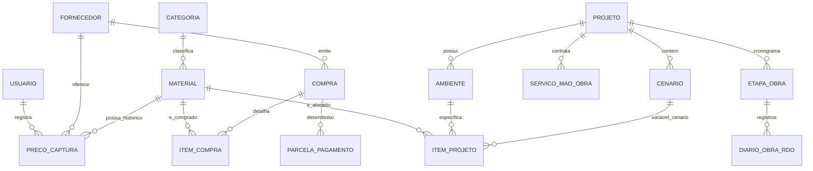

# 🗄️ Modelo de Dados e Arquitetura Relacional — Sistema de Obras

Este documento descreve as entidades, relacionamentos, chaves e tipos de dados do **Sistema de Obras**, preparado tanto para execução offline local (SQLite / IndexedDB) quanto para sincronização em nuvem (PostgreSQL / Supabase).

---

## 1. Diagrama Entidade-Relacionamento (ERD)

---

## 2. Dicionário de Dados Detalhado

### 2.1 Módulo Suprimentos e Catálogo

#### Tabela: `fornecedor`
Representa lojas, home centers, depósitos e prestadores comerciais.
* `id` (UUID / INTEGER PRIMARY KEY): Identificador único.
* `nome` (VARCHAR(150) NOT NULL): Razão Social ou Nome Fantasia (ex: "JER Depósito", "Hiper Pedras").
* `tipo_parceiro` (VARCHAR(50)): Depósito de Bairro, Home Center, Marmoraria, Gesso, Elétrica.
* `cnpj` (VARCHAR(20)): Cadastro nacional de pessoa jurídica (opcional).
* `telefone_contato` (VARCHAR(30)): WhatsApp ou telefone de vendas.
* `endereco` (TEXT): Endereço físico da filial.
* `latitude` / `longitude` (DECIMAL(10,8)): Coordenadas GPS para detecção automática de loja no app.

#### Tabela: `categoria`
Taxonomia multinível configurável (`Classe → Categoria → Tipo`).
* `id` (INTEGER PRIMARY KEY AUTOINCREMENT)
* `classe` (VARCHAR(50) NOT NULL): Ex: "Bruto", "Revestimento", "Hidráulica", "Elétrica", "Louças/Metais".
* `subcategoria` (VARCHAR(50)): Ex: "Piso", "Parede", "Tubulações", "Disjuntores".
* `tipo` (VARCHAR(50)): Ex: "Porcelanato Retificado", "Argamassa AC-III".
* `unidade_padrao` (VARCHAR(15)): m², un, saco, barra, rolo, m³.

#### Tabela: `material`
Catálogo unificado de itens técnicos.
* `id` (UUID / INTEGER PRIMARY KEY)
* `categoria_id` (FK -> categoria.id)
* `descricao` (VARCHAR(255) NOT NULL): Nome comercial padronizado do item.
* `fabricante` (VARCHAR(100)): Marca do produto (ex: Portobello, Tigre, Votoran).
* `modelo_sku` (VARCHAR(100)): Código de barras (EAN), referência de fábrica ou SKU de gôndola.
* `unidade_venda` (VARCHAR(20) NOT NULL): Como a loja comercializa (ex: "caixa", "un", "saco 50kg").
* `fator_embalagem` (DECIMAL(10,3) DEFAULT 1.000): Quantidade consumível por embalagem (ex: 2.14 m² por caixa de porcelanato).
* `foto_referencia_url` (TEXT): Imagem padrão do produto ou etiqueta.

#### Tabela: `preco_captura`
Histórico de coletas e cotações realizadas em lojas físicas ou virtuais.
* `id` (UUID / INTEGER PRIMARY KEY)
* `material_id` (FK -> material.id)
* `fornecedor_id` (FK -> fornecedor.id)
* `preco_vista` (DECIMAL(12,2) NOT NULL): Preço à vista (Pix, débito ou dinheiro).
* `preco_prazo` (DECIMAL(12,2)): Preço anunciado a prazo/cartão.
* `data_captura` (TIMESTAMP NOT NULL): Data e hora da verificação.
* `usuario_id` (FK -> usuario.id): Responsável pela coleta.
* `foto_etiqueta_url` (TEXT): Foto original da gôndola para auditoria visual.

---

### 2.2 Módulo de Projetos, Ambientes e Cenários

#### Tabela: `projeto`
Obra ou conjunto de frentes de trabalho.
* `id` (UUID / INTEGER PRIMARY KEY)
* `nome` (VARCHAR(150) NOT NULL): Ex: "Reforma ICENV 2026".
* `status` (VARCHAR(30)): "Planejamento", "Em Execução", "Concluído", "Suspenso".
* `data_inicio` (DATE): Data oficial de início (ex: 2026-10-13).
* `data_previsao_fim` (DATE): Prazo estimado (ex: 2026-11-15).
* `orcamento_teto` (DECIMAL(14,2)): Limite orçamentário aprovado.

#### Tabela: `ambiente`
Frentes de obra ou cômodos individuais.
* `id` (UUID / INTEGER PRIMARY KEY)
* `projeto_id` (FK -> projeto.id)
* `nome` (VARCHAR(100) NOT NULL): Ex: "Banheiro Casa Pastoral", "Banheiro Masculino Igreja".
* `area_piso` (DECIMAL(10,2)): Área em m² de piso.
* `area_parede` (DECIMAL(10,2)): Área em m² de paredes revestidas.
* `perimetro` (DECIMAL(10,2)): Medida linear para rodapés e soleiras.

#### Tabela: `cenario`
Permite comparações de custo (ex: "Opção Standard" vs "Opção Premium").
* `id` (UUID / INTEGER PRIMARY KEY)
* `projeto_id` (FK -> projeto.id)
* `nome` (VARCHAR(50) NOT NULL): Nome do cenário.
* `ativo` (BOOLEAN DEFAULT TRUE): Cenário atualmente selecionado como base.

#### Tabela: `item_projeto`
Especificação dos insumos por ambiente e cenário.
* `id` (UUID / INTEGER PRIMARY KEY)
* `ambiente_id` (FK -> ambiente.id)
* `material_id` (FK -> material.id)
* `cenario_id` (FK -> cenario.id)
* `qtd_necessaria_liquida` (DECIMAL(10,2)): Quantidade exata de projeto.
* `margem_perda_pct` (DECIMAL(5,2) DEFAULT 10.00): % adicional para corte e quebra.
* `qtd_calculada_bruta` (DECIMAL(10,2)): Quantidade com margem de perda.
* `qtd_embalagem_fechada` (INTEGER): Número de caixas/sacos arredondados para cima.
* `preco_unitario_estimado` (DECIMAL(12,2)): Preço de referência para o orçamento.

---

### 2.3 Módulo Financeiro, Compras e Mão de Obra

#### Tabela: `servico_mao_obra`
Contratos e medições de mão de obra.
* `id` (UUID / INTEGER PRIMARY KEY)
* `projeto_id` (FK -> projeto.id)
* `prestador_nome` (VARCHAR(120) NOT NULL): Ex: "Wagner".
* `escopo_etapa` (VARCHAR(200)): Ex: "Demolição e assentamento Banheiro Casa Pastoral".
* `valor_contratado` (DECIMAL(12,2) NOT NULL)
* `valor_pago_acumulado` (DECIMAL(12,2) DEFAULT 0.00)
* `status` (VARCHAR(30)): "A Iniciar", "Em Andamento", "Medido", "Concluído".

#### Tabela: `compra`
Aquisições reais realizadas para a obra.
* `id` (UUID / INTEGER PRIMARY KEY)
* `fornecedor_id` (FK -> fornecedor.id)
* `numero_nf` (VARCHAR(50)): Número da nota fiscal ou cupom.
* `data_compra` (DATE NOT NULL)
* `valor_total` (DECIMAL(12,2) NOT NULL)
* `valor_desconto_geral` (DECIMAL(12,2) DEFAULT 0.00): Desconto concedido no balcão.
* `valor_frete` (DECIMAL(12,2) DEFAULT 0.00)
* `forma_pagamento` (VARCHAR(30)): "A Vista", "Pix", "Cartao Credito", "Boleto".
* `quantidade_parcelas` (INTEGER DEFAULT 1)
* `foto_nf_url` (TEXT): Anexo digital do cupom/NF.

#### Tabela: `parcela_pagamento`
Detalhamento do fluxo de caixa e vencimentos de parcelas.
* `id` (UUID / INTEGER PRIMARY KEY)
* `compra_id` (FK -> compra.id)
* `numero_parcela` (INTEGER NOT NULL): 1, 2, 3...
* `data_vencimento` (DATE NOT NULL)
* `valor_parcela` (DECIMAL(12,2) NOT NULL)
* `data_pagamento_efetivo` (DATE): Data em que a tesouraria quitou a parcela.
* `status` (VARCHAR(20)): "Pendente", "Pago", "Atrasado".

#### Tabela: `item_compra`
Relação de itens contidos em cada compra (fechando o Planejado vs Realizado).
* `id` (UUID / INTEGER PRIMARY KEY)
* `compra_id` (FK -> compra.id)
* `item_projeto_id` (FK -> item_projeto.id, opcional caso seja compra avulsa)
* `material_id` (FK -> material.id)
* `qtd_comprada` (DECIMAL(10,2) NOT NULL)
* `preco_unitario_real` (DECIMAL(12,2) NOT NULL)

---

### 2.4 Módulo de Execução e Canteiro (RDO)

#### Tabela: `etapa_obra`
Estrutura do cronograma semanal (WBS/EAP).
* `id` (UUID / INTEGER PRIMARY KEY)
* `projeto_id` (FK -> projeto.id)
* `nome_etapa` (VARCHAR(100)): Ex: "Semana 1: Demolição e Beiral".
* `data_inicio_prevista` (DATE)
* `data_fim_prevista` (DATE)
* `percentual_concluido` (INTEGER DEFAULT 0)
* `status` (VARCHAR(30)): "Não Iniciada", "Em Andamento", "Concluída".

#### Tabela: `diario_obra_rdo`
Relatório Diário de Obra preenchido no canteiro.
* `id` (UUID / INTEGER PRIMARY KEY)
* `etapa_obra_id` (FK -> etapa_obra.id)
* `data_registro` (DATE NOT NULL)
* `condicoes_climaticas` (VARCHAR(30)): "Bom", "Chuva", "Nublado".
* `efetivo_pedreiros` (INTEGER DEFAULT 0)
* `efetivo_ajudantes` (INTEGER DEFAULT 0)
* `atividades_realizadas` (TEXT NOT NULL)
* `ocorrencias_imprevistos` (TEXT)
* `fotos_urls` (JSON / TEXT): Array de links das fotos do dia.